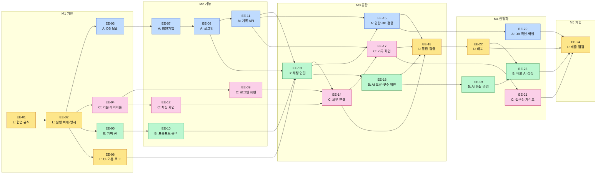
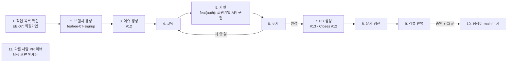

# 작업 길잡이

| 언제 | 보는 곳 |
|---|---|
| 프로젝트에 처음 참여할 때 **한 번** | [1. 처음 할 일](#1-처음-할-일) — 환경 준비 · 뼈대 둘러보기 |
| 기능 하나를 만들 때마다 **매번** | [2. 매번 하는 루틴](#2-매번-하는-루틴) → [작업 목록](#작업-목록)에서 내 할 일 확인 |
| 규칙이 헷갈릴 때 | [3. 참고](#3-참고) — 커밋 메시지 · 코드 규칙 · **역할별 안내** · 문제 해결 |

---

# 1. 처음 할 일

GitHub 저장소 초대를 수락한 뒤 아래를 순서대로 실행합니다.

```bash
brew install uv                                       # uv 설치 (Windows: https://docs.astral.sh/uv/)
git clone https://github.com/easy-explain/Codyssey-B7-1-Term-Project.git
cd Codyssey-B7-1-Term-Project
git config --local user.name "본인 이름"                # 커밋 작성자 = 본인
git config --local user.email "본인 GitHub 이메일"
uv sync                                               # Python 3.12 + 패키지를 팀원과 같은 버전으로 설치
cp .env.example .env                                  # 서버 설정 파일 (비워 두면 가짜 AI 로 동작)
uv run pytest                                         # ✅ 전부 통과하면 준비 끝
```

| 알아 둘 것 | |
|---|---|
| `uv run 명령` | 이 프로젝트 전용 파이썬으로 실행 (시스템 파이썬·conda 와 안 섞임) |
| 서버 켜 보기 | `uv run uvicorn app.main:app --reload` → http://localhost:8000/health |
| VS Code | `Cmd/Ctrl + Shift + P` → Python: Select Interpreter → `./.venv` |
| 실제 AI 써 보기 | `.env` 에 `AI_PROVIDER=anthropic` + **본인 키**. 키는 공유 금지 |
| AI 코딩 도구 | 저장소의 `AGENTS.md` 를 읽게 한다 (Codex 는 자동, Claude Code 는 `CLAUDE.md` 를 통해 읽음) |

준비가 끝나면 이 순서로 읽습니다: 아래 [뼈대 둘러보기](#뼈대-둘러보기) → [역할별 안내](#역할별-안내)의 내 역할 →
[API 명세](docs/spec/api.md)의 내 담당 API → [평가 대비](docs/team/2-evaluation-example.md)의 내 역할 섹션

## 뼈대 둘러보기

서버는 이미 실행되고, **기능이 들어갈 자리와 공통 장치**가 갖춰져 있습니다. 각자는 자기 자리에 기능만 채우면 됩니다.
쓰는 법은 [코드 규칙](#코드-규칙)에 있습니다.

| 파일 | 하는 일 |
|---|---|
| `pyproject.toml` `uv.lock` | Python 3.12·패키지 버전 고정 → `uv sync` 한 번으로 모두 같은 환경 |
| `app/main.py` `app/health.py` | 서버 조립, `/health`. 라우터만 만들면 자동으로 연결됨 |
| `app/core/config.py` | `.env` 읽기·검증 → `SettingsDep` |
| `app/core/middleware.py` | 요청마다 요청 ID 부여 + 요청 로그 (직접 신경 쓸 필요 없음) |
| `app/core/logging.py` | `log_event()` — 요청 ID 가 붙은 이벤트 로그 |
| `app/core/errors.py` | `AppError` — 정해진 오류 JSON 으로 응답 |
| `app/db/session.py` | DB 연결 → `SessionDep` |
| `app/auth/dependencies.py` `app/chat/provider.py` | 영역 간 약속(모양만). **다른 사람 작업을 기다리지 않고** 개발 가능 |
| `app/*/router.py` | 모든 API 자리. 지금은 전부 501 |
| `tests/conftest.py` | `client` fixture — 임시 DB·가짜 AI 로 테스트. `logged_in_client` — 로그인한 상태로 테스트 |
| `.github/workflows/ci.yml` | PR 을 올리면 자동으로 검사·테스트 |

**"501 NOT_IMPLEMENTED" 가 뭔가요?** 아직 안 만든 기능이 "성공"인 척하지 않도록 일부러 "미구현" 오류를 돌려주게 해 둔 것입니다.
기능을 구현하면서 `raise not_implemented("EE-XX")` 줄을 실제 코드로 바꾸면 됩니다.

---

# 2. 매번 하는 루틴

## 작업 순서 한눈에 보기

색은 담당 역할입니다. 화살표는 "먼저 끝나야 하는 작업"입니다. (GitHub 에서 그림으로 보입니다)



🟨 **L** 이초롱 (팀장) · 🟦 **A** 송지윤 (인증·DB) · 🟩 **B** 나현준 (AI·채팅) · 🩷 **C** 유민규 (화면) — 팀 소개는 [README 3장](README.md#3-주요-기능과-역할-분담)

## 루틴 11단계



끝나면 1번으로 돌아갑니다. **한 번에 진행하는 작업은 1개**입니다.
예시는 A 가 `EE-07 회원가입` 을 하고, 이슈 번호가 `#12`, PR 번호가 `#13` 인 경우입니다.

### 1. 작업 목록 확인

- **할 일**: 내 역할의 ⬜ 작업 중 가장 앞 번호를 고른다
- **어디서**: 이 문서 [작업 목록](#작업-목록)
- **방법**: `담당` 열에서 내 역할·이름을 찾고 → `선행` 열의 작업이 모두 ✅ 인지 확인
- **주의**: 선행 작업이 안 끝났으면 시작하지 말고 담당자에게 진행 상황을 묻는다

### 2. 브랜치 생성

- **할 일**: main 을 최신으로 받은 뒤 내 작업용 브랜치를 만든다
- **방법**:
  ```bash
  git switch main
  git pull origin main
  uv sync
  git switch -c feat/ee-07-signup        # 종류/ee-번호-짧은-영어-설명
  ```
  종류: `feat` 기능 · `fix` 버그 · `test` 테스트 · `docs` 문서 · `chore` 설정
- **주의**: main 에서 바로 코딩하지 않는다. 이어서 작업할 때는 `git switch feat/ee-07-signup`

### 3. 이슈 생성

- **할 일**: 이번 작업의 이슈를 만들고 번호를 확인한다
- **어디서**: GitHub
- **방법**:
  1. 저장소 → **Issues** → **New issue** → **작업** 템플릿 선택
  2. 제목 `[EE-07] 회원가입·비밀번호 해시` (작업 목록의 코드·작업명 그대로)
  3. 본문에 목표 · 할 일 · 완료 조건 채우기
  4. 오른쪽 **Assignees** → 본인 → **Submit new issue**
- **주의**: 생긴 번호(`#12`)를 기억한다. 커밋 `Refs #12`, PR `Closes #12` 에 쓴다

### 4. 코딩

- **할 일**: 내 담당 폴더에서 기능과 테스트를 함께 만든다
- **방법**: 요청·응답 형식은 [API 명세](docs/spec/api.md), 테이블은 [DB 구조](docs/spec/db.md) 를 그대로 따른다.
  자세한 규칙은 [코드 규칙](#코드-규칙)
- **주의**:
  - [내 폴더](#역할별-안내) 밖 파일은 고치지 않는다. 필요하면 담당자와 먼저 이야기
  - 오류는 `AppError`, 못 만든 기능은 `not_implemented("EE-XX")` (가짜 성공 금지)
  - 명세와 다르게 만들어야 하면 코드보다 명세를 먼저 고친다 (8단계)

### 5. 커밋

- **할 일**: 검사·테스트를 통과시킨 뒤 이번 일에 해당하는 파일만 커밋한다
- **방법**:
  ```bash
  uv run ruff check .                     # 코드 검사
  uv run pytest                           # 테스트
  git status                              # 바뀐 파일 확인
  git add app/auth/router.py tests/auth/test_signup.py     # 이번 커밋에 넣을 파일만
  git status                              # .env · .db 가 담기지 않았는지 확인
  git commit -m "feat(auth): 회원가입 API 구현" -m "Refs #12"
  ```
- **메시지 형식**: `종류(영역): 무엇을 했는지 한국어로` + 빈 줄 + `Refs #이슈번호` — 종류·영역 표와 예시는 [커밋 메시지 규칙](#커밋-메시지-규칙)
- **주의**:
  - 검사·테스트가 실패하면 커밋하지 않는다. 테스트를 지우거나 skip 해서 넘기지 않는다
  - `git add .` 대신 파일을 골라 담는다. `.env` · `.db` 파일은 절대 담지 않는다
  - 한 커밋 = 한 가지 일. 기능 → 테스트 → 오류 처리로 나누면 **1인 10개 이상**이 자연스럽게 채워진다
  - 개수 채우기용 커밋 금지

### 6. 푸시

- **할 일**: 커밋을 **내 개인 브랜치**(`feat/ee-07-signup`)에 올린다. main 에 올리는 게 아니다
- **방법**:
  ```bash
  git branch --show-current               # 지금 브랜치가 main 이 아닌지 확인
  git push -u origin feat/ee-07-signup    # 처음 (GitHub 에 내 브랜치가 생김)
  git push                                # 두 번째부터
  ```
- **주의**: main 으로 직접 푸시하지 않는다 (main 은 7~10단계 PR 로만 바뀐다). `--force` 금지. 하루가 끝나면 완성 전이라도 푸시해 둔다

### 7. PR 생성

- **할 일**: 내 브랜치를 main 에 합쳐 달라고 요청한다
- **어디서**: GitHub
- **방법**: 저장소 → **[Compare & pull request]**

  | 항목 | 입력 |
  |---|---|
  | base ← compare | `main` ← `feat/ee-07-signup` |
  | 제목 | `[EE-07] 회원가입 API 구현` |
  | 본문 | 템플릿 빈칸 + `Closes #12` |
  | Reviewers | 리뷰 짝: L 이초롱 → A 송지윤 또는 B 나현준 · A 송지윤 → B 나현준 · B 나현준 → A 송지윤 · C 유민규 → L 이초롱 또는 A 송지윤<br>팀장 이초롱은 `.github/CODEOWNERS` 로 **자동 지정**된다 |
  | Assignees | 본인 |
- **주의**: 생긴 PR 번호(`#13`)를 8단계 작업 목록에 적는다. 실행 못 한 테스트는 "미실행"이라고 쓴다. 만든 뒤 **CI ✅** 확인 (❌ 이면 Details → 고쳐서 푸시). 단톡에 PR 링크 공유

### 8. 문서 갱신

- **할 일**: 작업 결과를 문서에 반영해 같은 PR 에 올린다
- **어디서**: [이 문서](#작업-목록) · [README](README.md) · [docs/spec](docs/spec/)
- **방법**:

  | 언제 | 고칠 곳 |
  |---|---|
  | **항상** | 이 문서 [작업 목록](#작업-목록) — 내 줄 ⬜ → ✅, 이슈 · PR 번호 |
  | 기능이 완성됐으면 | [README](README.md) 3장 기능 표 — 상태 · PR |
  | API 가 바뀌었으면 | [docs/spec/api.md](docs/spec/api.md) |
  | DB 가 바뀌었으면 | [docs/spec/db.md](docs/spec/db.md) |

  ```bash
  git add CONTRIBUTING.md README.md
  git commit -m "docs: EE-07 완료 표시"
  git push                                # 같은 PR 에 자동으로 추가됨
  ```
- **주의**: API 를 바꿨으면 화면 담당 C 에게 꼭 알린다

### 9. 리뷰 반영

- **할 일**: 리뷰 코멘트를 고쳐서 다시 확인받는다
- **어디서**: GitHub
- **방법**: 코멘트대로 수정 → 5·6단계처럼 커밋·푸시 (같은 PR 에 자동 추가) → 코멘트에 답글 후 **Resolve conversation** → 리뷰어 옆 🔄 로 **재요청**
- **주의**: 동의하지 않는 코멘트는 그냥 Resolve 하지 말고 이유를 답글로 남긴다

### 10. main 머지

- **할 일**: 승인된 PR 을 **팀장이** main 에 합치고, 작성자는 내 컴퓨터를 정리한다
- **어디서**: GitHub
- **방법**:
  1. 작성자: **승인 1명 + CI ✅ + 대화 모두 해결** 확인 → 단톡에 "머지 부탁드려요 + PR 링크"
  2. **팀장 이초롱이** [Merge pull request] → [Confirm merge]. 팀장의 PR 도 팀원 1명이 승인한 뒤 팀장이 머지한다
  3. 작성자: 머지되면 내 컴퓨터 정리
     ```bash
     git switch main
     git pull origin main
     uv sync
     git branch -d feat/ee-07-signup         # 내 컴퓨터 브랜치만 삭제 (GitHub 브랜치는 남김)
     ```
- **주의**: 새 커밋을 올리면 승인이 취소되니 재요청한다. 머지 방식은 Create a merge commit 만 허용.
  main 반영은 GitHub 설정으로 **팀장만** 가능하다 (코드 일관성·보안을 위해 마지막 확인을 한 사람이 맡는다)

### 11. 다른 사람 PR 리뷰

- **할 일**: 리뷰 요청이 오면 기한 안에 확인하고 결론을 낸다
- **어디서**: GitHub — PR → **Files changed**
- **방법**: 아래를 확인 → 코드 줄 옆 **+** 로 코멘트 → **[Review changes]** → Approve / Request changes
  - [ ] 이슈에서 하기로 한 일을 했는가
  - [ ] API 명세 · DB 구조와 맞는가 (바뀌었다면 문서도 고쳤는가)
  - [ ] 테스트가 있는가
  - [ ] 키 · 비밀번호 · `.env` · DB 파일이 없는가
  - [ ] 담당 폴더 밖을 말없이 고치지 않았는가
  - [ ] 작업 목록이 갱신되었는가
- **주의**: 코멘트에는 "왜"를 함께 쓴다. 사소한 건 `nit:` 을 붙인다

## 작업 목록

⬜ 시작 전 · 🟨 일부 완료 · ✅ 완료 — 8단계(문서 갱신)에서 내 줄을 고칩니다.

| 상태 | 코드 | 담당 | 작업 | 선행 | 이슈 | PR |
|:---:|:---:|:---:|---|---|:---:|:---:|
| **M1 기반** | | | | | | |
| 🟨 | EE-01 | L 이초롱 | 저장소 협업 규칙·역할·작업 보드 | — | [#1](https://github.com/easy-explain/Codyssey-B7-1-Term-Project/issues/1) | [#4](https://github.com/easy-explain/Codyssey-B7-1-Term-Project/pull/4) |
| ✅ | EE-02 | L 이초롱 | FastAPI 실행 뼈대·API/DB 명세 v1 | 01 | [#2](https://github.com/easy-explain/Codyssey-B7-1-Term-Project/issues/2) | [#4](https://github.com/easy-explain/Codyssey-B7-1-Term-Project/pull/4) |
| ⬜ | EE-03 | A 송지윤 | 회원·세션·대화·턴 DB 모델 | 02 | | |
| ⬜ | EE-04 | C 유민규 | 공통 웹 레이아웃·스타일 | 02 | | |
| ⬜ | EE-05 | B 나현준 | AI provider 경계·가짜 AI 구현 | 02 | | |
| ✅ | EE-06 | L 이초롱 | CI·request_id·공통 오류·이벤트 로그 | 02 | [#3](https://github.com/easy-explain/Codyssey-B7-1-Term-Project/issues/3) | [#4](https://github.com/easy-explain/Codyssey-B7-1-Term-Project/pull/4) |
| **M2 기능** | | | | | | |
| ⬜ | EE-07 | A 송지윤 | 회원가입·비밀번호 해시 | 03 | | |
| ⬜ | EE-08 | A 송지윤 | 로그인·세션·로그아웃·CSRF | 07 | | |
| ⬜ | EE-09 | C 유민규 | 회원가입·로그인 화면 | 04 | | |
| ⬜ | EE-10 | B 나현준 | 설명 수준 프롬프트·최근 문맥 구성 | 05 | | |
| ⬜ | EE-11 | A 송지윤 | 대화 저장소·본인 기록 API | 08 | | |
| ⬜ | EE-12 | C 유민규 | 챗 입력·수준 선택·안전한 응답 표시 | 04 | | |
| **M3 통합** | | | | | | |
| ⬜ | EE-13 | B 나현준 | 실제 AI 연결·채팅 API 처리 순서 | 06·08·10·11 | | |
| ⬜ | EE-14 | C 유민규 | 화면 API 통합·로딩·오류·재시도 | 09·12·13 | | |
| ⬜ | EE-15 | A 송지윤 | 권한·DB 실패·중복 요청 회귀 검증 | 11·13 | | |
| ⬜ | EE-16 | B 나현준 | AI 오류 매핑·중복/질문 횟수 제한 | 13 | | |
| ⬜ | EE-17 | C 유민규 | 내 기록 화면·모바일·대화 이어가기 | 11·14 | | |
| ⬜ | EE-18 | L 이초롱 | 전체 통합·보안·실패 경로 회귀 검증 | 14·15·16·17 | | |
| **M4 안정화** | | | | | | |
| ⬜ | EE-19 | B 나현준 | AI 테스트·설명 품질 샘플 증빙 | 16 | | |
| ⬜ | EE-20 | A 송지윤 | DB 확인·백업/복구·기여 문서 | 15 | | |
| ⬜ | EE-21 | C 유민규 | 접근성·화면 검증·사용 가이드 | 17 | | |
| ⬜ | EE-22 | L 이초롱 | 외부 배포·영속 DB·재시작 검증 | 18 | | |
| ⬜ | EE-23 | B 나현준 | 배포 환경 실제 AI·시간 초과 검증 기록 | 19·22 | | |
| **M5 제출** | | | | | | |
| ⬜ | EE-24 | L 이초롱 | 제출 요구사항·4인 기여·릴리스 점검 | 20·21·22·23 | | |

---

# 3. 참고

## 커밋 메시지 규칙

```
종류(영역): 무엇을 했는지 한국어로          ← 50자 안팎, 마침표 없이
(선택) 빈 줄 + 왜 바꿨는지
Refs #이슈번호
```

| 종류 | 뜻 | | 영역 | 뜻 |
|---|---|---|---|---|
| `feat` | 새 기능 | | `auth` | 로그인 |
| `fix` | 버그 수정 | | `db` | DB |
| `test` | 테스트 | | `conversations` | 대화 기록 |
| `refactor` | 코드 정리 | | `chat` | AI 채팅 |
| `style` | CSS | | `web` | 화면 |
| `docs` | 문서 | | `core` | 공통 |
| `chore` | 설정·패키지 | | `deploy` | 배포 |
| `ci` | 자동 검사 | | (생략) | 애매할 때 |

✅ `feat(auth): 로그인 시 세션 토큰 발급과 쿠키 설정` ❌ `수정` · `feat: 작업중` · `update files`

## 코드 규칙

| 상황 | 이렇게 | 하지 않기 |
|---|---|---|
| 오류 응답 | `raise AppError(404, ErrorCode.CONVERSATION_NOT_FOUND, "대화를 찾을 수 없어요.")` | `HTTPException` |
| 아직 못 만든 기능 | `raise not_implemented("EE-13")` | 가짜 성공 응답 |
| 서버 로그 | `log_event("ai_call_start", user_id=user.id)` | `print` |
| 설정 · 로그인 사용자 · DB | 함수 인자에 `SettingsDep` · `CurrentUserDep` · `SessionDep` | 값 직접 쓰기, 요청에서 `user_id` 받기 |
| 테스트 | `client` fixture (임시 DB + 가짜 AI), 로그인이 필요하면 `logged_in_client` | 실제 AI 키가 필요한 테스트 |
| 패키지 추가 | 팀장에게 알린 뒤 `uv add 이름` | `pip install` |

## 역할별 안내

네 명이 **동시에** 시작합니다. 첫 작업은 [작업 목록](#작업-목록)에서 내 역할의 가장 앞 번호입니다.
**내 폴더** 밖의 파일은 고치지 않습니다. 필요하면 담당자와 먼저 이야기합니다.

### 👑 L 이초롱 — 팀장 · 공통 뼈대, 오류·로그, CI, 통합, 배포

- **내 폴더:** `app/main.py` `app/core/` `app/health.py` `tests/conftest.py` `tests/core/` `tests/integration/` `.github/` `docs/` `pyproject.toml` `uv.lock`
- **할 일:** 다른 영역에 필요한 공통 기능 요청 처리, 통합 테스트, 배포

### 🔐 A 송지윤 — 회원·로그인·접근 제어, DB, 내 기록

- **내 폴더:** `app/db/` `app/auth/` `app/conversations/` `tests/auth/` `tests/conversations/` `scripts/` (DB 확인 도구)
- **채울 곳:** `app/db/models.py` ([DB 구조](docs/spec/db.md) 그대로), `app/auth/router.py`, `app/auth/dependencies.py` 의 `get_current_user`·`get_optional_user`·`require_csrf`, `app/conversations/router.py`
- **다른 사람이 기다리는 것:** `get_current_user` (B·C 가 사용), `get_optional_user` (C 의 페이지가 사용), 대화 저장·조회 함수 (B 가 사용).
  EE-13 이 가장 많이 기다리는 작업이니, 완성 전이라도 **함수 이름과 인자를 먼저 정해서 B 에게 공유**한다
- **꼭 지킬 것:** 비밀번호는 `pwdlib` 의 Argon2 해시로만 저장. 입력 규칙은 [API 명세 2장](docs/spec/api.md#가입로그인-입력-규칙-실패-시-422-validation_error). 조회는 항상 로그인 사용자 ID 조건 포함

### 🤖 B 나현준 — AI 호출, 설명 수준, 문맥 유지, AI 오류

- **내 폴더:** `app/chat/` `tests/chat/`
- **가짜 AI:** `AIProvider` 를 따르는 `FakeAIProvider`. 정상 응답·타임아웃·상위 오류·빈 응답을 재현할 수 있게
- **provider 선택:** `app/chat/provider.py` 에 `get_ai_provider` 의존성(`AIProviderDep`)을 만들고 `settings.ai_provider` 로 고른다.
  테스트는 `app.dependency_overrides[get_ai_provider]` 로 타임아웃 내는 가짜를 끼운다 ([API 명세 5장](docs/spec/api.md#5-내부-경계-영역-간-약속))
- **프롬프트·문맥:** 수준별 시스템 프롬프트와 "최근 5턴 → 메시지 배열" 만들기를 **순수 함수**로 → DB·AI 없이 테스트 가능
- **실제 AI:** `anthropic` SDK 에 `base_url=settings.anthropic_base_url` 을 넘겨 코디세이 게이트웨이로 호출. `max_retries=0`, 타임아웃 30초
- **질문 횟수 제한:** AI 를 부르기 전에 사용자별 1분 횟수(`settings.user_requests_per_minute`)와
  서비스 전체 하루 횟수(`settings.daily_request_limit`)를 확인하고, 넘으면 `429 RATE_LIMITED`. 서버 메모리에 세는 정도로 충분
- **기다리지 않는 법:** 로그인은 `user: CurrentUserDep` 로 받기만 하면 된다. 테스트는 `logged_in_client` 로 하면
  A 의 로그인(EE-08) 없이도 핸들러까지 도달한다. A 가 구현하면 실제 서버에서도 자동으로 동작
- **꼭 지킬 것:** 실제 키가 필요한 테스트를 기본 테스트에 넣지 않는다. 로그에 질문·답변 원문을 남기지 않는다

### 🎨 C 유민규 — 웹 화면, API 연결, 사용성

- **내 폴더:** `app/web/` `app/templates/` `app/static/` `tests/web/`
- **공통 레이아웃:** `app/templates/base.html`, `app/static/` 의 CSS, `app/web/router.py` 의 `/` 페이지
- **로그인 페이지 이동:** `/chat`·`/history` 는 `user: OptionalUserDep` 로 받고 `None` 이면 `/login` 으로 303. 테스트는 `logged_in_client`
- **기다리지 않는 법:** API 가 완성되기 전에는 [API 명세](docs/spec/api.md)의 **응답 예시 JSON 을 그대로 써서** 화면을 먼저 만든다.
  나중에 실제 API 로 주소만 바꾸면 된다
- **꼭 지킬 것:** AI 답변은 `innerHTML` 이 아니라 `textContent` 로 표시 (스크립트 실행 방지).
  권한 검사는 서버가 한다. 화면에서 버튼을 숨기는 것만으로 막았다고 보지 않는다.
  오류는 응답의 `error.message` 를 보여 주고, 입력한 내용은 지우지 않는다

## 문제 해결

| 상황 | 해결 |
|---|---|
| main 에서 코딩을 시작했다 (커밋 전) | `git switch -c feat/ee-07-signup` — 바뀐 내용을 들고 새 브랜치로 |
| main 에 커밋해 버렸다 | 혼자 되돌리지 말고 팀장에게 공유 |
| 푸시 `rejected` / PR 에 충돌 | `git switch main && git pull` → `git switch 내브랜치` → `git merge main` → 충돌 정리 → 테스트 → 커밋 → 푸시 |
| 커밋 메시지 실수 (푸시 전) | `git commit --amend -m "올바른 메시지"` (푸시 후에는 그대로 둠) |
| CI ❌ | PR 의 Details → 로컬에서 `uv run ruff check .` / `uv run pytest` 로 재현 → 고쳐서 푸시 |
| 테스트가 내 컴퓨터에서만 실패 | `git pull` → `uv sync` 후 다시. 안 되면 에러와 함께 공유 |
| **키·`.env` 를 올렸다** | **즉시 팀장에게 알리고 키 재발급** |
| 30분 넘게 막혔다 | 혼자 붙잡지 말고 단톡이나 이슈에 무엇을 하려다 · 어떤 에러가 · 무엇을 시도했는지 적어 공유 |
| 다른 사람 작업을 기다려야 한다 | 가짜 데이터·고정 응답으로 먼저 진행하고, 이슈에 "○○ 기다리는 중" 표시 |
| 명세가 애매하다 | 추측해서 만들지 말고 담당자·팀장에게 확인 → 결정 내용을 `docs/` 에 반영 |

## 하지 않는 것

main 직접 푸시 · `--force` · `reset --hard` · 테스트 삭제로 실패 숨기기 · 키·`.env`·DB 커밋 · 키를 단톡·스크린샷으로 공유 ·
로그에 비밀번호·토큰·키·질문/답변 원문 남기기 · 개수 채우기용 커밋 ·
**이해하지 못한 AI 생성 코드 커밋** (평가 때 내 코드는 내가 설명합니다 → [평가 대비](docs/team/2-evaluation-example.md))
