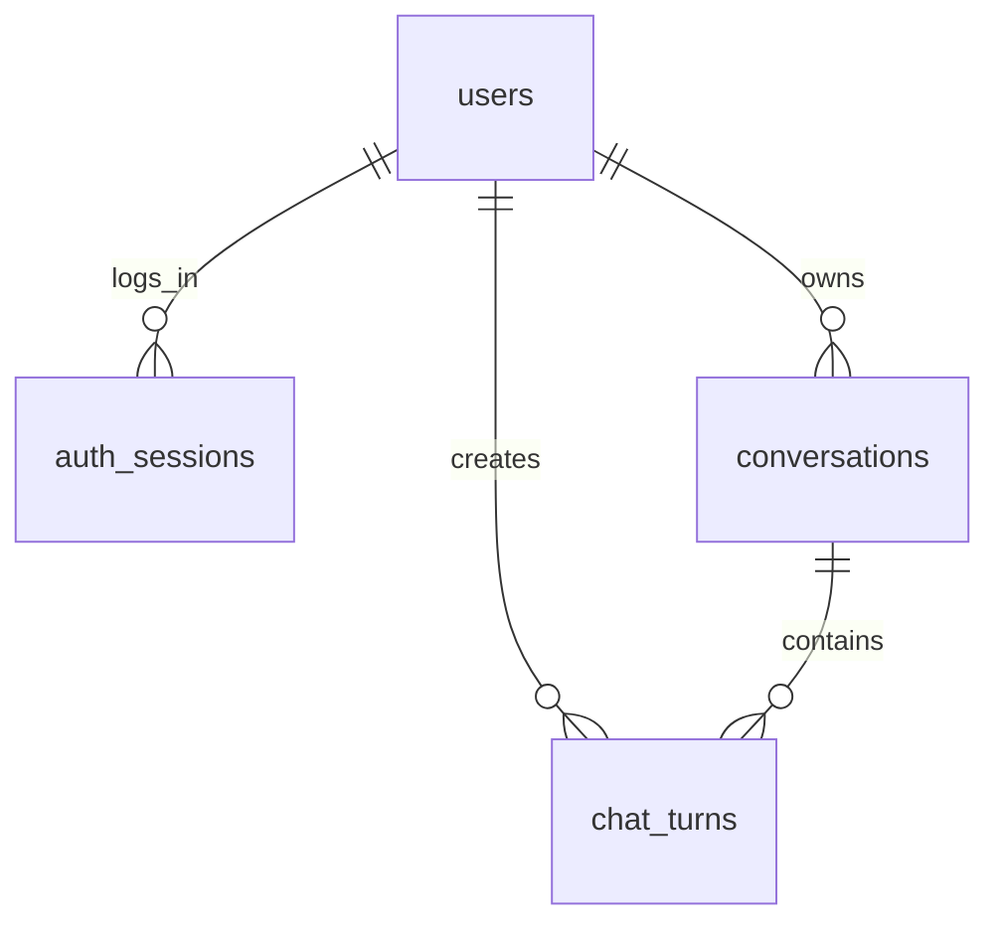

# DB 구조 v1

SQLite + SQLModel. 테이블은 앱 시작 시 `init_db()` 가 만든다. (A 가 `app/db/models.py` 에 정의, EE-03)

## users — 회원
| 필드 | 타입 | 설명 |
|---|---|---|
| id | int PK | |
| email | str, unique | 소문자·공백 제거로 정규화해서 저장 |
| password_hash | str | Argon2 해시. 평문 저장 금지 |
| created_at | datetime (UTC) | |

## auth_sessions — 로그인 세션 (서버에서 취소 가능)
| 필드 | 타입 | 설명 |
|---|---|---|
| id | int PK | |
| user_id | int FK → users.id | |
| token_hash | str, unique | 쿠키에 준 토큰의 해시. 토큰 원문은 저장하지 않음 |
| csrf_token | str | 로그인 응답으로 내려 주는 CSRF 토큰 |
| created_at | datetime | |
| expires_at | datetime | 기본 2시간 (`SESSION_TTL_SECONDS`) |

## conversations — 대화 묶음
| 필드 | 타입 | 설명 |
|---|---|---|
| id | UUID PK | |
| user_id | int FK → users.id, index | 소유자 |
| title | str | 첫 질문 일부 등 |
| created_at / updated_at | datetime | |

## chat_turns — 질문·응답 한 쌍 (과제 "대화 로그")
| 필드 | 타입 | 설명 |
|---|---|---|
| id | int PK | |
| conversation_id | UUID FK → conversations.id | |
| user_id | int FK → users.id | 대화 소유자와 같아야 함 (저장소 함수에서 강제) |
| client_request_id | UUID | 중복 전송 식별 |
| request_id | str | 서버 로그와 연결하는 추적 ID |
| level | str | `easy` / `beginner` / `advanced` |
| question | str | |
| answer | str, nullable | 완료 전·실패 시 null |
| status | str | `pending` / `completed` / `failed` / `interrupted` |
| error_code | str, nullable | 실패 시 `ErrorCode` 값 |
| created_at | datetime | |
| completed_at | datetime, nullable | |

제약·인덱스
- `UNIQUE (user_id, client_request_id)`
- `INDEX (conversation_id, created_at, id)` — 문맥·상세 조회
- SQLite 외래키는 `app/db/session.py` 에서 `PRAGMA foreign_keys=ON` 으로 켠다.

과제 최소 필드(사용자 식별, 생성 시각, 질문, 응답)는 `chat_turns` 의
`user_id, created_at, question, answer` 이다.

## 저장 순서 (POST /api/chat)
1. 검증 통과 → `pending` 턴 저장·commit
2. DB 트랜잭션을 잡지 않은 채 AI 호출 (최대 `AI_TIMEOUT_SECONDS`)
3. 성공 → `answer, status=completed, completed_at` 저장 / 실패 → `status=failed, error_code` 저장
4. DB 저장 실패 → rollback, `db_save_failed` 로그, 503 `DB_ERROR` (성공으로 위장하지 않음)
5. 재시작으로 남은 오래된 `pending` 은 `interrupted` 로 정리. 자동 재호출하지 않음

## 운영 원칙
- 실제 DB 파일은 Git 에 올리지 않는다. (`.gitignore`: `data/`, `*.db`)
- 스키마를 바꿀 때 운영 DB 를 지워서 해결하지 않는다. 백업 후 명시적으로 변경한다.
