# 화면 검증 기록 (EE-21)

키보드와 휴대폰으로 쓸 수 있는지, 글자가 잘 보이는지 화면마다 확인한 항목과 방법을 한곳에 모았습니다.
**모든 화면에서 키보드만으로 가입 → 로그인 → 질문 → 내 기록 → 로그아웃까지 썼고, 375px·320px 에서 가로로 넘치지 않으며, 오류 안내 뒤 버튼이 다시 켜지는 것을 확인했습니다.**
점검하면서 찾은 문제 5가지는 고쳤습니다(6장). 자동으로 다시 확인할 수 있는 것은 이 폴더의 테스트로 굳혔습니다.
기록과 캡처는 C 담당 영역이면서 이슈 #28 범위인 `tests/web/`에 모았습니다. 위치는 팀장 리뷰에서 확인합니다.

## 1. 확인 환경

| 항목 | 내용 |
|---|---|
| 날짜 | 2026-10-10 |
| 서버 | 실제 앱(가입·로그인·세션·CSRF·대화·채팅·기록 조회 모두 실제 코드), 임시 DB. AI 는 로컬 모의 게이트웨이(실제 키·외부 호출 없음) |
| 브라우저 | Chrome 154 (헤드리스) — 데스크톱 1280×800, 휴대폰 흉내 375×812·320×640, 페이지 확대 200%·400%, 글자만 200%, 글자 간격 넓힘, 움직임 줄이기·다크 모드·고대비 흉내 |
| 계정 | 가짜 계정만 (`guide@example.com` 등). 캡처에 실제 이메일·키·쿠키는 없습니다 |
| 자동 테스트 | `uv run pytest tests/web` (Node 동작 테스트 `node --test tests/web/js/` 포함) |
| 브라우저 확인 | 헤드리스 Chrome 을 CDP 로 조종하는 스크립트(담당자 개인 폴더, 저장소 밖). 결과 수를 아래에 적고, 같은 확인을 손으로 하는 방법을 4장에 적었습니다 |

캡처의 답변 글은 팀이 기록한 실제 AI 샘플([EE-19](../../app/chat/EE-19.md))을 모의 게이트웨이가 다시 돌려준 것입니다.

## 2. 화면별 설명

모든 화면은 같은 틀입니다 — 맨 앞의 **본문으로 건너뛰기**(처음 Tab 에만 보임), 머리말(로고·채팅·내 기록·로그인/로그아웃), 본문(`main`), 바닥글.
랜드마크는 `header`·`nav`(주 메뉴)·`main`·`footer` 하나씩이고, 화면마다 `h1` 이 하나입니다. Tab 순서는 머리말 다음부터 적습니다.

### 소개 `/`

서비스 소개, 같은 질문의 세 가지 수준 예시, [시작하기]·[로그인]. 제목은 h1 → h2 2개 → h3 3개 순서입니다.
Tab: 건너뛰기 → 로고 → 채팅 → 내 기록 → 로그인 → **시작하기** → 로그인

| 데스크톱 | 휴대폰 375px |
|:---:|:---:|
| 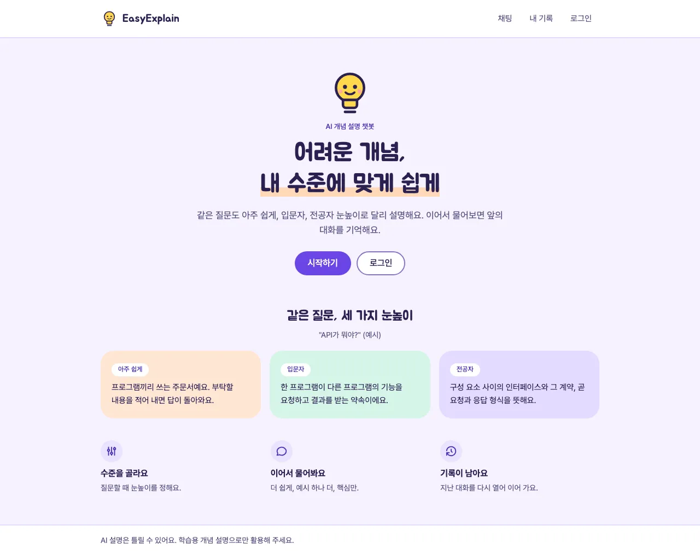 | 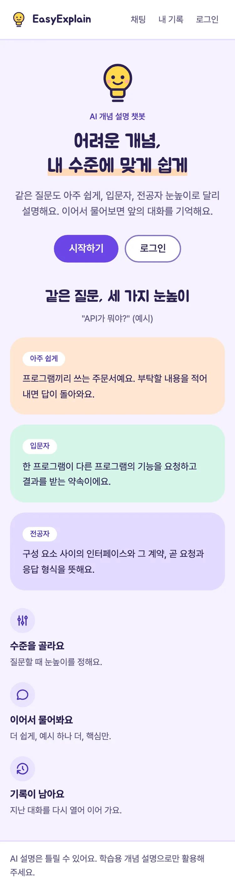 |

### 회원가입 `/signup`

이메일(100자까지, 형식 검사)과 비밀번호(8~64자, 영문·숫자·기호) → [가입하기]. 화면이 먼저 검사하고 서버가 최종 검사합니다.
입력칸 이름은 label("이메일", "비밀번호"), 설명은 아래 안내 글이고 오류가 나면 오류 문구도 설명에 붙습니다.
오류가 나면 오류 칸(`role="alert"`)에 문구가 뜨고 포커스가 오류 칸으로 갑니다. Tab 한 번이면 이메일 칸이고, 입력한 내용은 그대로입니다.
Tab: 건너뛰기 → 로고 → 채팅 → 내 기록 → 로그인 → **이메일 → 비밀번호 → 가입하기 → 로그인**(전환 링크)

| 데스크톱 | 오류 안내 뒤 (이미 가입한 이메일, 409) | 휴대폰 375px |
|:---:|:---:|:---:|
| 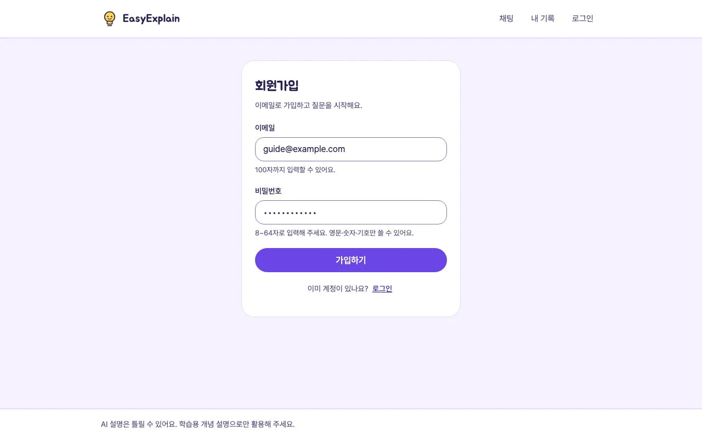 | 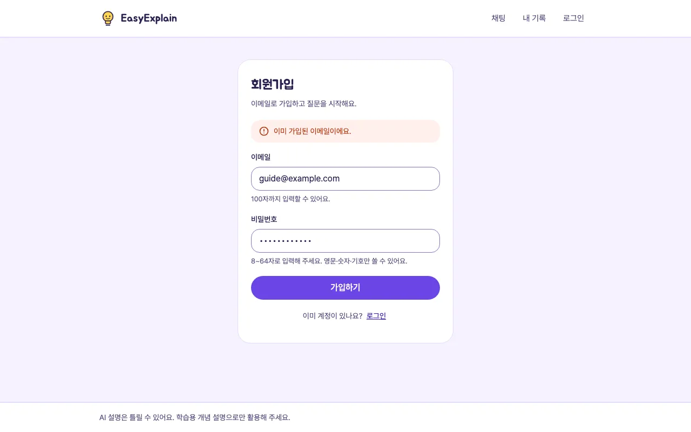 | 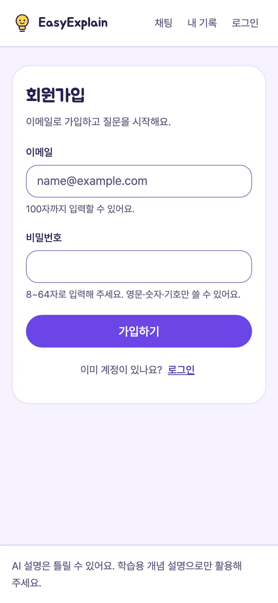 |

### 로그인 `/login`

가입 직후(`?joined=1`)에는 "가입이 끝났어요", 로그인이 풀려 넘어오면(`?expired=1`) "로그인이 풀렸어요" 안내가 보입니다.
오류(틀린 비밀번호 401)는 가입과 같은 방식입니다. 성공하면 채팅 화면으로 갑니다.
Tab: 건너뛰기 → 로고 → 채팅 → 내 기록 → 로그인 → **이메일 → 비밀번호 → 로그인 → 회원가입**(전환 링크)

| 데스크톱 (가입 직후) | 오류 안내 뒤 (401) | 휴대폰 375px |
|:---:|:---:|:---:|
| 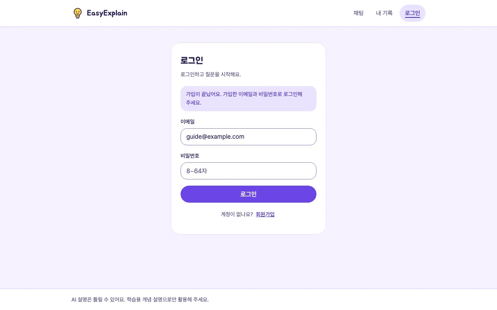 | 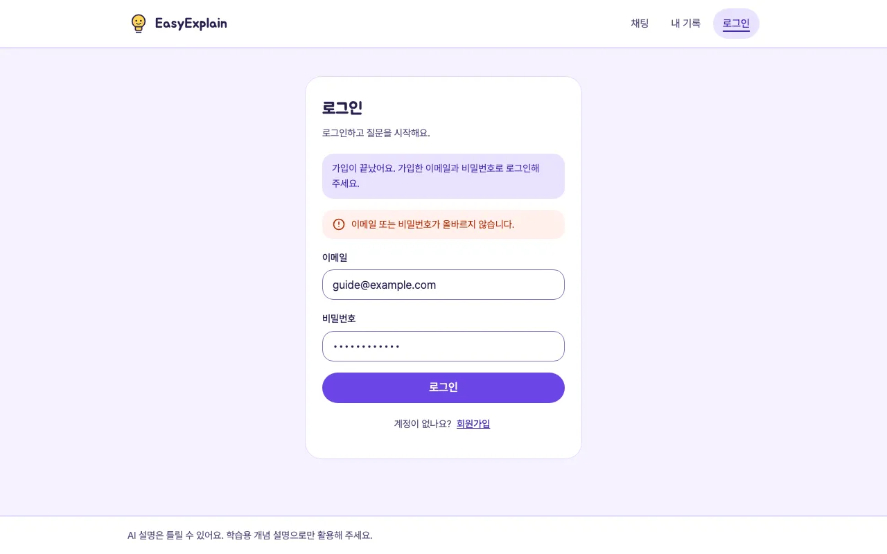 | 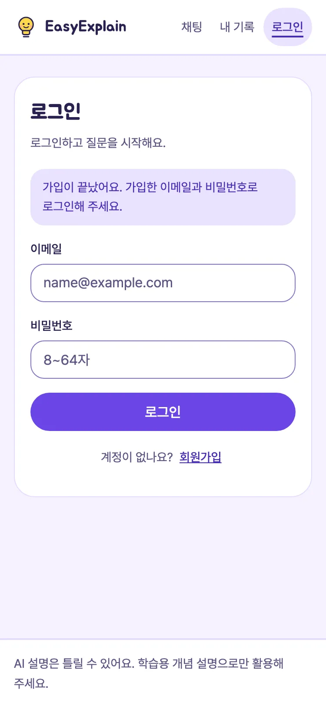 |

### 채팅 `/chat`

수준 고르기(라디오 3개, 묶음 이름 "설명 수준", ←→ 화살표), [새 대화], 질문 칸(이름 "질문", 설명 "Enter 를 누르면 보내고 Shift 와 Enter 를 함께 누르면 줄을 바꿔요"), [보내기].
답을 받으면 후속 버튼 3개(더 쉽게·예시 하나 더·핵심만)가 질문 칸 위에 나타나고, 포커스는 원래 자리(질문 칸 또는 누른 후속 버튼)로 돌아옵니다.
기다리는 동안은 "답변을 만드는 중"(`role="status"`)과 함께 보내기·후속·새 대화가 잠기고, 오류가 나면 오류 칸(`role="alert"`)과 [다시 보내기]에 포커스가 갑니다.
Tab: 건너뛰기 → 로고 → 채팅 → 내 기록 → 로그아웃 → **수준(고른 것) → 새 대화 → (다시 보내기) → (후속 3개) → 질문 → 보내기**

| 데스크톱 (답변·후속 버튼) | 오류 안내와 다시 보내기 | 휴대폰 375px (이어서 연 대화) |
|:---:|:---:|:---:|
| 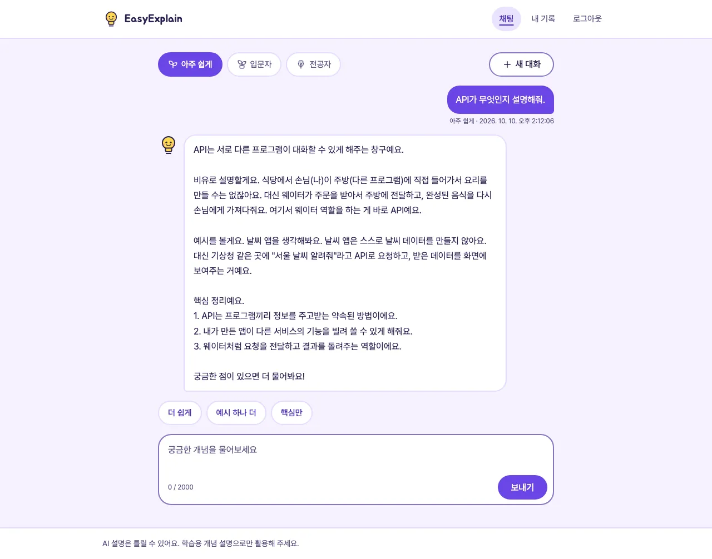 | 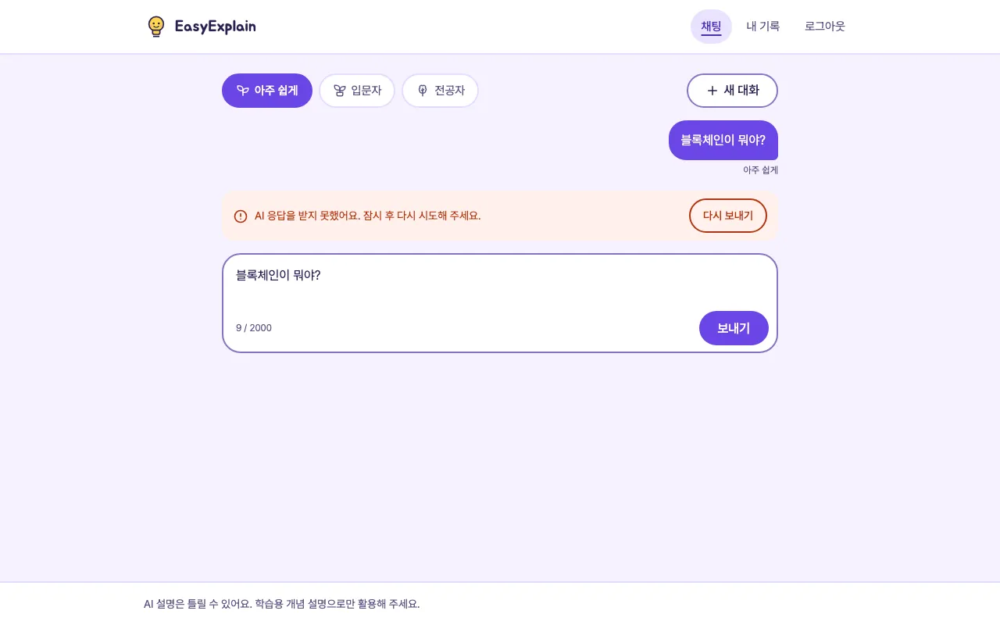 | 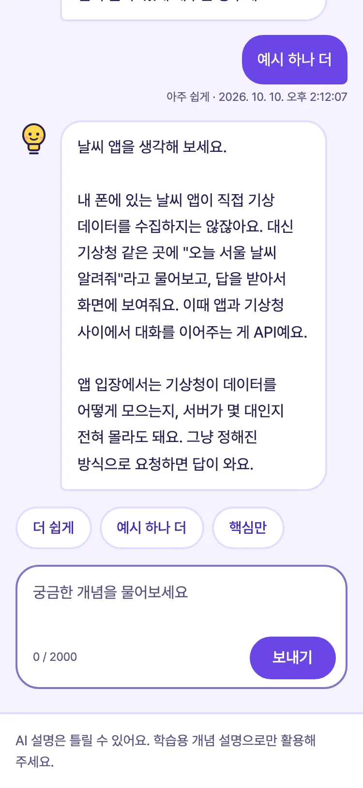 |

### 내 기록 `/history`

최근에 질문한 대화가 위, 20개씩 [더 보기]. 카드 하나가 상세로 가는 링크이고 이름은 "제목 + 시각"입니다.
더 보기를 누르면 새로 붙은 첫 대화로 포커스가 갑니다.
Tab: 건너뛰기 → 로고 → 채팅 → 내 기록 → 로그아웃 → **대화 카드들 → 더 보기**

### 대화 상세 `/history?conversation=…`

대화 제목(h2), "질문 N개 · 시작 시각", 질문·답변(오래된 순, 수준·한국 시간), [목록으로]·[이어서 질문].
답을 받지 못한 턴은 "~해요" 안내로 보이고, 2개 이상 이어지면 "답을 받지 못한 질문 N개"(펼치기 버튼, Enter·Space)로 접힙니다.
목록에서 들어오면 포커스는 대화 제목, [목록으로]로 돌아가면 방금 본 카드입니다. 없는 대화는 "대화를 찾을 수 없어요." 안내만 보이고 빈 제목은 숨깁니다.
Tab: 건너뛰기 → 로고 → 채팅 → 내 기록 → 로그아웃 → **목록으로 → 이어서 질문 → (접힌 실패 묶음) → 이어서 질문**

| 목록 (데스크톱) | 목록 (휴대폰 375px) | 상세 (데스크톱) | 상세 (휴대폰 375px) |
|:---:|:---:|:---:|:---:|
| 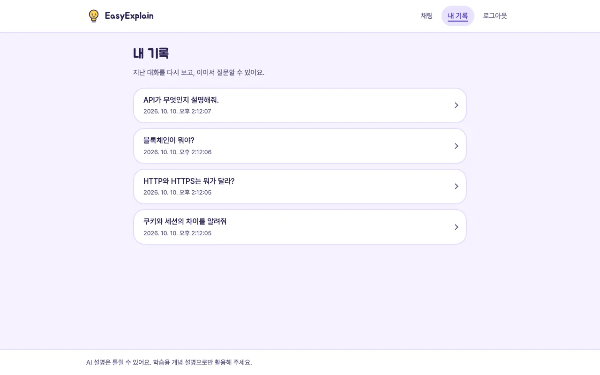 | 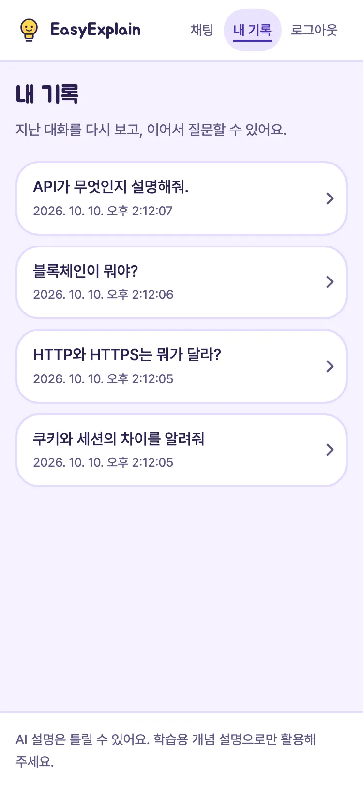 | 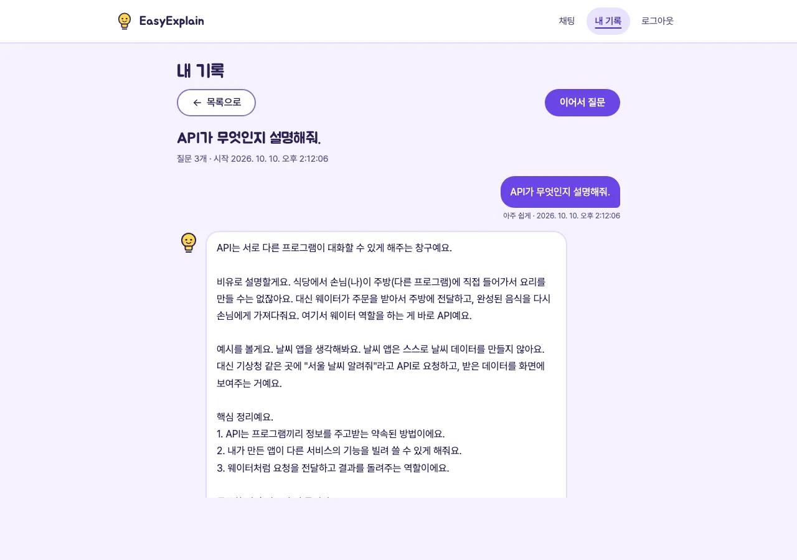 | 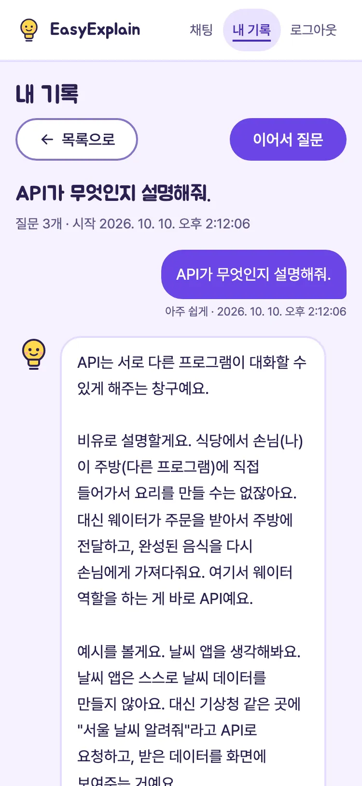 |

키보드로 첫 Tab 을 누르면 나타나는 본문으로 건너뛰기:

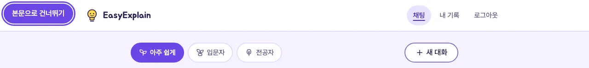

## 3. 검증 체크리스트

이슈 #28 의 세 항목(**키보드 접근, 375px 가로 넘침 없음, 오류 안내 후 버튼 잠금 해제**)을 굵게 표시했습니다.
"브라우저"는 헤드리스 Chrome 으로 실제 앱을 연 확인, 파일 이름은 이 폴더의 자동 테스트입니다.

| # | 항목 | 기준 | 확인 방법 | 결과 |
|---|---|---|---|---|
| 1 | **키보드만으로 가입·로그인·질문** | 마우스 없이 처음부터 끝까지 | 브라우저: 키 입력(Tab·Shift+Tab·Enter·Space·←→·글자)만으로 소개 → 가입(빈 값·이미 있는 이메일 오류 포함) → 로그인(틀린 비밀번호 포함) → 수준 고르기 → 질문(Enter) → 후속(Space·Enter) → 줄바꿈(Shift+Enter) → 오류·다시 보내기 → 내 기록 → 상세 → 실패 묶음 펼치기·접기 → 목록으로 → 이어서 질문 → 로그아웃 | 51/51 통과 |
| 2 | 입력칸 label | 모든 입력칸에 이름, 안내·오류 문구가 설명으로 연결 | `test_accessibility.py`(입력칸 이름·참조하는 id·수준 묶음), 브라우저 접근성 트리(이름·설명) | 통과 |
| 3 | 본문으로 건너뛰기 | 첫 Tab 에 왼쪽 위에 보이고, Enter 면 본문, 다음 Tab 이 본문의 첫 컨트롤 | `test_accessibility.py`, 브라우저 5화면(소개·가입·로그인·채팅·내 기록) | 통과 |
| 4 | **Tab 순서·포커스 갇힘** | 화면 순서와 같고, 한 바퀴 돌아 처음으로, Shift+Tab 은 거꾸로 같은 순서 | 브라우저 8화면 Tab·Shift+Tab 한 바퀴 | 통과 |
| 5 | 포커스 테두리 | 멈추는 곳마다 보이고 바탕과 3:1 이상 | 브라우저: 멈춘 곳 87곳 모두 3px 테두리, 최소 5.25:1. `test_accessibility.py`(테두리를 지우는 곳은 대신 그리는 질문 칸 하나뿐) | 통과 |
| 6 | 제목·랜드마크·언어·id·그림 | h1 하나·단계 건너뜀 없음·빈 제목 없음, header·nav·main·footer, `lang="ko"`, 중복 id 없음, 그림 `alt`, 꾸밈 아이콘 숨김, 버튼·링크 이름 | `test_accessibility.py`(10화면 × 비로그인·로그인), 브라우저 33상태 | 통과 |
| 7 | 오류가 나면 포커스가 갈 곳 | 가입·로그인 → 오류 칸, 채팅 서버 오류 → 다시 보내기, 입력 오류 → 질문 칸, 한도 초과 → 오류 칸 | `js/auth_form.test.mjs`, `js/chat_retry.test.mjs`, 브라우저 | 통과 |
| 8 | **오류 안내 후 버튼 잠금 해제** | 오류 문구가 뜬 뒤 버튼이 다시 눌리고 글자가 돌아오며, 입력은 남고, 다시 누르면 실제로 보냄 | 가입 409·로그인 401·연결 끊김·JSON 이 아닌 응답: `js/auth_form.test.mjs`(11개) + 브라우저. 채팅 502·504·연결 끊김: 브라우저 + `js/chat_retry.test.mjs`. 질문 한도(429): 10초 잠금 뒤 풀림(브라우저에서 9.4초). 더 보기·다시 시도·로그아웃 실패: 브라우저 | 브라우저 25가지 통과 |
| 9 | 글자·배경 대비 | 보통 글자 4.5:1, 큰 글자 3:1 | `test_contrast.py`(조합 23개 계산), 브라우저: 33상태의 보이는 글자 879개 실측 → 16조합, 최소 5.57:1(잠긴 버튼 5.00:1) | 통과 — 5장 표 |
| 10 | 입력칸·구성 요소 경계 | 3:1 | 입력칸 테두리 3.97:1, 연보라 바탕 위 질문 상자 3.60:1 (계산·실측 같음) | 통과 |
| 11 | **375px 가로 넘침 없음** | 가로 스크롤 0px | 브라우저 375·320px: 모든 화면과 상태(답변·오류·실패 펼침·빈 목록·더 보기 뒤) | 통과 |
| 12 | 누르는 곳 크기 | 44×44px 이상 | 브라우저 1280·375·320px 의 모든 링크·버튼·입력칸, `test_mobile_style.py` | 통과 |
| 13 | 확대·글자 크기 | 페이지 확대 200%·400%, 글자만 200%, 글자 간격(WCAG 1.4.12)에서 넘침·잘린 글 없음 | 브라우저 7화면 × 6조건 | 42/42 통과 |
| 14 | 움직임 줄이기 | 운영체제 설정을 켜면 "답변을 만드는 중"의 점이 깜빡이지 않음 | 브라우저, `test_accessibility.py` | 통과 |
| 15 | 다크 모드 설정 | 화면 색과 대비가 밝은 모드와 같음 | 브라우저 | 통과 |
| 16 | 고대비(강제 색) 모드 | 고른 수준·지금 메뉴·포커스 테두리가 보임 | 브라우저 흉내, `test_accessibility.py` | 통과 (이번에 고침) |
| 17 | 색에만 기대지 않음 | 오류 = 아이콘 + 문구, 답이 없는 턴 = 문구, 지금 메뉴 = 밑줄, 고른 수준 = 채운 모양 | 캡처, `test_accessibility.py` | 통과 (메뉴 밑줄은 이번에 더함) |
| 18 | 기존 화면 회귀 | EE-12·14·17 에서 확인한 것이 그대로 | 브라우저: 채팅 63·흐름 33·재전송 19·리뷰 9·422/404 5·429 16·헤더 15·로그아웃 14·내 기록 85 | 통과 (채팅 Tab 순서는 건너뛰기 링크만큼 한 칸 밀린 것이 맞음) |

**확인하지 못한 것:** 실제 스크린리더(VoiceOver·NVDA·TalkBack) — 접근성 트리의 이름·역할·설명까지만 봤습니다. Safari·Firefox, 휴대폰 실기기, 배포 주소(이 변경이 머지·배포되기 전).

## 4. 손으로 다시 확인하는 법 (키보드만, 5분)

1. 소개 화면에서 마우스를 쓰지 않고 Tab → 왼쪽 위에 [본문으로 건너뛰기]가 보이는지 → Enter → Tab → [시작하기] → Enter
2. 가입: 빈 채로 Enter → 오류 칸에 안내, [가입하기]는 그대로 눌림 → Tab 으로 이메일·비밀번호를 쓰고 Enter
3. 로그인: 틀린 비밀번호로 Enter → 안내가 뜨고 [로그인]이 다시 눌림 → Tab 두 번으로 비밀번호 칸 → 고쳐서 Enter
4. 채팅: ←→ 로 수준 고르기 → Tab 으로 질문 칸 → Enter 로 보내기(Shift+Enter 는 줄바꿈) → Shift+Tab 으로 후속 버튼 → Space
5. Shift+Tab 으로 위쪽 [내 기록] → Enter → 카드에서 Enter → 제목에 테두리 → Tab 으로 [이어서 질문] → Enter
6. Shift+Tab 으로 [로그아웃] → Enter
7. 개발자 도구의 기기 모드에서 375px·320px 로 바꿔 가로 스크롤이 생기지 않는지 보기

## 5. 글자·배경 대비 표

`style.css` 의 색 값으로 계산한 값입니다(`test_contrast.py` 와 같은 값). 기준은 WCAG AA 입니다.

| 글자(또는 테두리) | 바탕 | 대비 | 기준 | 쓰는 곳 |
|---|---|---|---|---|
| `--text` #2A2150 | `--bg` #F6F2FF | **13.31:1** | 4.5:1 | 본문 글자 — 채팅 첫 안내, 내 기록 제목, 소개의 특징 |
| `--text` #2A2150 | `--surface` #FFFFFF | **14.67:1** | 4.5:1 | 흰 바탕 글자 — 로고, 가입·로그인 카드, 답변 말풍선, 기록 카드 제목 |
| `--text` #2A2150 | `--accent-soft` #EAE2FF | **11.75:1** | 4.5:1 | 마우스를 올린 보조 버튼·기록 카드 |
| `--text` #2A2150 | `--level-easy` #FFE6D4 | **12.24:1** | 4.5:1 | 소개의 수준 카드 설명 (아주 쉽게) |
| `--text` #2A2150 | `--level-beginner` #D5F5E7 | **12.60:1** | 4.5:1 | 소개의 수준 카드 설명 (입문자) |
| `--text` #2A2150 | `--level-advanced` #E3DBFF | **11.06:1** | 4.5:1 | 소개의 수준 카드 설명 (전공자) |
| `--text` #2A2150 | `--highlight` #FFD9B8 | **11.08:1** | 3:1 (큰 글자) | 소개 큰 제목(44px)의 형광펜 부분 |
| `--text-muted` #5E5784 | `--bg` #F6F2FF | **6.01:1** | 4.5:1 | 보조 글자 — 소개 문구, 기록 안내, 말풍선 아래 수준·시각 |
| `--text-muted` #5E5784 | `--surface` #FFFFFF | **6.62:1** | 4.5:1 | 흰 바탕 보조 글자 — 메뉴, 바닥글, 입력칸 안내·자리 표시 |
| `--text-muted` #5E5784 | `--accent-soft` #EAE2FF | **5.30:1** | 4.5:1 | 마우스를 올린 기록 카드의 시각 |
| `--text-muted` #5E5784 | `--line` #E4DBFF | **5.00:1** | 4.5:1 | 잠긴 버튼(보내기·후속 등) — WCAG 예외지만 읽히게 |
| `--accent-text` #4A2FB5 | `--bg` #F6F2FF | **8.06:1** | 4.5:1 | 소개의 작은 제목 (AI 개념 설명 챗봇) |
| `--accent-text` #4A2FB5 | `--surface` #FFFFFF | **8.88:1** | 4.5:1 | 수준 이름표, 후속 버튼, 가입·로그인 전환 링크 |
| `--accent-text` #4A2FB5 | `--accent-soft` #EAE2FF | **7.11:1** | 4.5:1 | 메뉴의 지금 위치, 가입 직후·로그인 풀림 안내 |
| `--on-accent` #FFFFFF | `--accent` #6B46E5 | **5.78:1** | 4.5:1 | 주요 버튼, 내 질문 말풍선, 고른 수준, 건너뛰기 링크 |
| `--on-accent` #FFFFFF | `--accent-hover` #5835CC | **7.51:1** | 4.5:1 | 마우스를 올린 주요 버튼 |
| `--error-text` #B3330F | `--error-bg` #FFF0EB | **5.57:1** | 4.5:1 | 오류 안내와 다시 보내기 버튼 |
| `--error-text` #B3330F | `--surface` #FFFFFF | **6.18:1** | 4.5:1 | 마우스를 올린 다시 보내기 버튼 |
| `--line-strong` #8574C4 | `--surface` #FFFFFF | **3.97:1** | 3:1 (경계) | 입력칸·질문 상자·보조 버튼 테두리 |
| `--line-strong` #8574C4 | `--bg` #F6F2FF | **3.60:1** | 3:1 (경계) | 질문 상자·접힌 실패 묶음 테두리 (연보라 바탕 위) |
| `--accent` #6B46E5 | `--bg` #F6F2FF | **5.25:1** | 3:1 (포커스) | 포커스 테두리 (연보라 바탕) |
| `--accent` #6B46E5 | `--surface` #FFFFFF | **5.78:1** | 3:1 (포커스) | 포커스 테두리 (흰 머리말·카드), 고른 수준과 고르지 않은 수준의 차이 |
| `--accent` #6B46E5 | `--error-bg` #FFF0EB | **5.21:1** | 3:1 (포커스) | 오류 칸 안 다시 보내기 버튼의 포커스 테두리 |

카드·버튼의 옅은 테두리(`--line`)는 꾸밈이라 기준이 없습니다 — 그 버튼들은 글자가 이름이고, 고른 수준은 채운 모양(5.78:1)으로 구분합니다.

## 6. 이번에 찾아서 고친 것

같은 데이터로 고치기 전 코드를 점검하면 구조·키보드·대비 503가지 중 479가지, 화면 표시 54가지 중 52가지가 통과합니다(실패 26가지가 모두 아래 5가지 문제). 고친 뒤에는 모두 통과합니다.

| 찾은 문제 | 어떻게 찾았나 | 고친 것 |
|---|---|---|
| 키보드로 쓰면 페이지마다 머리말 4곳을 지나야 본문에 닿음 | Tab 순서 | 맨 앞에 본문으로 건너뛰기 링크 (`base.html`, `style.css` 12장) |
| 오류가 없어도 질문 칸 설명 끝에 숨은 "다시 보내기" 버튼 글이 붙어 읽힘 | 접근성 트리의 설명 | 설명이 오류 칸 전체가 아니라 안의 글만 가리킴 (`chat.html`) |
| 없는 대화 주소에서 이름 없는 "제목 2" 가 남음 | 접근성 트리의 제목 | 비어 있는 대화 제목은 숨김 (`style.css` 12장) |
| 메뉴의 지금 위치가 연한 바탕색(흰 머리말과 1.2:1)으로만 구분됨 | 고대비 흉내·대비 계산 | 밑줄을 더함 (`style.css` 4장) |
| 고대비 모드에서 고른 수준이 다른 수준과 똑같이 보임 | 고대비(forced-colors) 흉내 | 고른 수준을 시스템 선택 색(Highlight)으로 (`style.css` 12장) |

## 7. 자동 테스트

| 파일 | 보는 것 |
|---|---|
| `test_accessibility.py` | 10화면 × 비로그인·로그인의 구조(언어·제목·랜드마크·건너뛰기·입력칸 이름·참조 id·중복 id·그림·버튼 이름·오류·상태 칸)와 CSS(건너뛰기 링크, 테두리를 지우는 곳, 움직임 줄이기, 메뉴 밑줄, 고대비) |
| `test_contrast.py` | 5장의 색 조합 23개 대비 계산. CSS 에서 글자·바탕·테두리에 쓰는 색이 이 목록에 없으면 실패 |
| `js/auth_form.test.mjs` | 가입·로그인 오류 안내 뒤 버튼 잠금 해제·포커스·입력 유지 (`auth.js` 를 Node 로 그대로 실행) |
| `test_mobile_style.py` | 휴대폰에서 한국어 낱말 단위 줄바꿈, 누르는 곳 44px |
| 그 밖 | 화면별 테스트(`test_auth_pages.py`, `test_chat_page.py`, `test_history_page.py` 등)와 JS 동작 테스트(`js/*.test.mjs`) |

이 테스트들이 정말 잡는지 보려고 일부러 망가뜨린 42가지(label 삭제, h1 중복, 대비 낮춤, 건너뛰기 링크 숨김, 오류 뒤 버튼을 다시 켜지 않음 등)가 모두 실패하는 것을 확인했습니다.

```bash
uv run pytest tests/web       # 구조·대비·스타일·서버 교차 (Node 동작 테스트 포함)
node --test tests/web/js/     # JS 동작만
```
